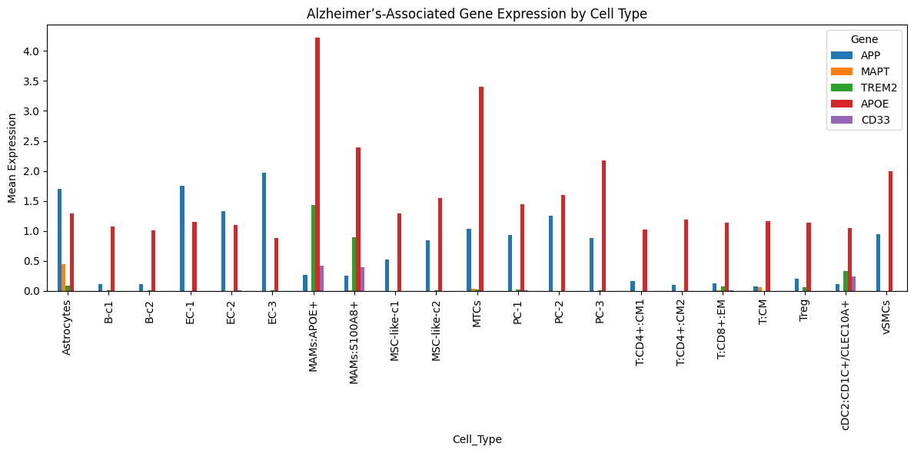
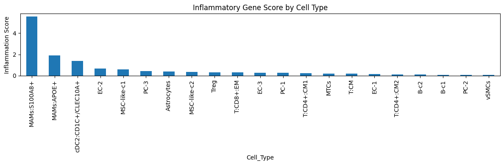
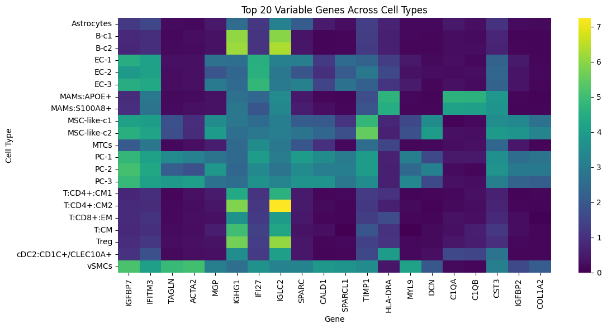
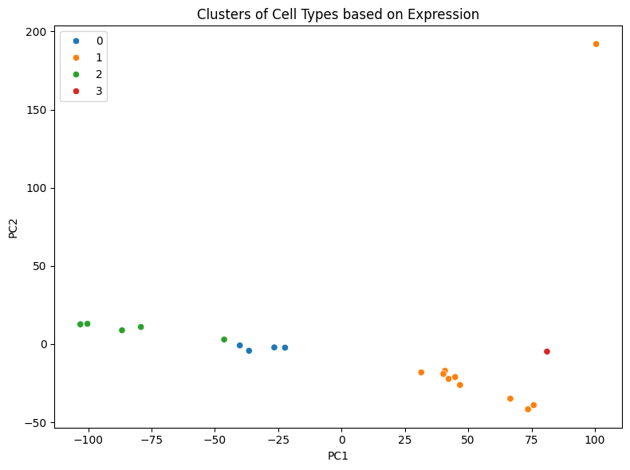

# Blood Transcriptomics for Precision Medicine

This project applies transcriptomic analysis of human blood and brain metastasis samples to discover cell-type-specific expression signatures relevant to **inflammation**, **neurodegeneration**, and **digital phenotyping**. This explores how gene expression can inform **P4 medicine** (Predictive, Preventive, Personalized, and Participatory).
---

## 📂 Data Sources
- **GSE63060** - Normalized blood transcriptomic data
- **GSM5645890** - Brain metastasis single-cell RNA-seq data with cell type annotations
---

## Project Goals
- Visualize and cluster cell types based on gene expression
- Compare **inflammatory** and **Alzheimer’s**-related genes across cell types
- Use **PCA** and **KMeans** to define digital phenotypes
- Score inflammatory burden per cell type
- Allow interactive gene panel selection
---
## 📈 Key Analyses

| Method | Purpose |
|--------|---------|
| Data normalization | Ensures comparability across samples |
| Gene symbol mapping | Maps probe IDs to gene names |
| Heatmaps & PCA | Highlights top 20 variable genes |
| Alzheimer’s panel | Focuses on genes like APP, MAPT, APOE, TREM2 |
| Inflammation score | Combines IL1B, IL6, TNF, CXCL8 expression |
| Clustering | KMeans on PCA-transformed data |

---
## Output Preview
Here are a few key visuals generated from the analysis:

- **Alzheimer’s Genes Across Cell Types**  
  

- **Inflammation Scores by Cell Type**  
  

- **Top Variable Genes Heatmap**  
  

- **Cell Type Clusters (PCA)**  
  

These figures help highlight which cell types may be more active in inflammation or neurodegenerative pathways, offering insights into disease mechanisms from a systems biology view.

---
## 🚀 How to Use

1. Open the notebook: [`Blood_Transcriptomics_Analysis.ipynb`](notebooks/Blood_Transcriptomics_Analysis.ipynb)
2. Follow the markdown explanations step-by-step
3. Choose your own genes of interest when prompted
4. Review the plots and summary results
---

## Relevance to Systems Biology
This project reflects principles of **data-driven systems medicine**:
- Integrates data from **bulk and single-cell** studies
- Uses **dimension reduction** + unsupervised clustering
- Builds **quantitative cell-type signatures** for immune/inflammatory profiling

It demonstrates how large-scale data can inform **precision diagnostics** and **cell-specific insights** — bridging data science and translational research.

---

## Author
**Zareen Rahman**
_Motivated by systems biology, and currently exploring opportunities to assist with translational research._

---

## License
MIT License – feel free to use or extend this work.
